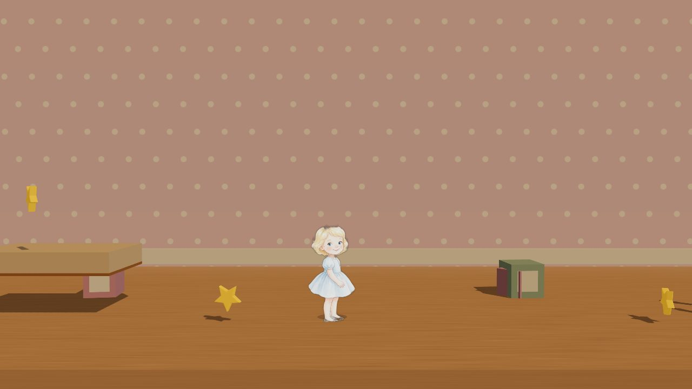

<div align="center">

# Weezy3D

**Princess Eloise in 3D — a browser platformer for kids, built with Three.js.**



</div>

## About

Eloise journeys out of her bedroom and through a series of connected rooms, collecting star tokens and meeting companions who each grant a new way to move. It's a metroidvania-flavored platformer for ages 4–8: gentle to pick up, with traversal abilities that gradually open up the world.

Under the hood it's a side-scrolling diorama — storybook character art rendered as billboards in a Three.js scene, driven by a pure 2D-platformer physics core. Levels are authored as coarse-grid sketches and compiled into validated game data, with a build-time lint that mathematically proves every level is completable before it ships.

## Features

- **Five continuous worlds** — Bedroom, Hallway, Kitchen, Family Room, and Backyard. Each world's hand-designed level segments are stitched into one seamless run, with former level boundaries becoming checkpoints.
- **Five traversal powers** — each unlocked by a companion: double-jump (Teddy), dash (Dog), wall-climb (Cat), charge-smash (Horse), and glide (Flamingo). Abilities gate progress metroidvania-style.
- **Enemies and combat** — patrolling enemies with stomp-to-defeat, a hearts system with invincibility frames, and respawn at the last checkpoint.
- **Keyboard and gamepad** — full support for both, including an 8BitDo SN30 Pro mapping.
- **Data-driven level design** — levels are authored in a coarse grid and compiled to game data. A build-time **reachability lint** derives the jump envelope from the physics constants and fails the build on any unsolvable level.
- **Tested and typed** — 400+ Vitest tests over the physics, level, and power systems; strict TypeScript throughout.

## Tech Stack

| Technology | Role |
|---|---|
| [Three.js](https://threejs.org) | 3D rendering — billboarded sprites on a side-scrolling diorama |
| TypeScript (strict) | Application language |
| [Vite 6](https://vitejs.dev) | Dev server and production build (multi-page) |
| [Zod](https://zod.dev) | Runtime validation of level JSON schemas |
| [Vitest](https://vitest.dev) | Unit and integration tests |

## Getting Started

```bash
npm install
npm run dev
```

Then open the game:

- **`http://localhost:5173/3d.html`** — the game. Add `?world=bedroom|hallway|kitchen|familyRoom|backyard` to jump to a world.
- **`http://localhost:5173/maps.html`** — the level-design surface (every world, every drafted variant, with segment boundaries).

Other scripts:

```bash
npm run build      # typecheck + tests + production build
npm test           # run the Vitest suite
npm run typecheck  # tsc --noEmit only
```

## Controls

| Action | Keyboard | Gamepad (8BitDo SN30 Pro) |
|---|---|---|
| Move | Arrow keys / A · D | D-pad or left stick |
| Jump / Double-jump | Space | Button 0 |
| Power (dash · charge · glide) | X | Button 1 |
| Wall-climb | W / Up | Stick or D-pad up |

Click the canvas once to give it focus if keys do nothing.

## Worlds

| World | Companion → Power | Signature beat |
|---|---|---|
| Bedroom | Teddy → double-jump | Tutorial; gate-free |
| Hallway | Dog → dash | Double-jump gaps |
| Kitchen | Cat → wall-climb | Vertical climbs; wall-climb + dash combos |
| Family Room | Horse → charge | Smash through barricades |
| Backyard | Flamingo → glide | Charge + glide finale |
| Playhouse | T-Rex boss | The climax (in development) |

## Project Layout

```
src/
  three/    The game — Three.js runtime (no Phaser): physics, input,
            world stitching, enemies, level rendering, HUD, themes
  logic/    Framework-agnostic game logic (air-jump, power dispatch,
            boss fight, cutscenes) — reusable across runtimes
  levels/   Authored level data + the build-time reachability lint
  design/   Level sketches (source of truth) and the maps.html surface
  config/   Physics, abilities, companions, areas, gating
  types/    Zod level schemas
```

## License

[MIT](LICENSE) © 2026 Matt OD

---

<div align="center"><sub>Built with TypeScript, Three.js, and <a href="https://claude.com/claude-code">Claude Code</a>.</sub></div>
